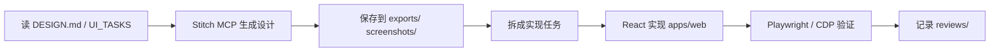

# Stitch 设计工作流

## 角色分工

| 角色 | 职责 |
|------|------|
| **Stitch** | 设计输入：原型、截图、HTML、DESIGN 变体 |
| **Cursor Agent** | 根据设计拆任务，在 `apps/web/` 落地实现 |
| **Codex** | 用户视角测试：发现问题，不修代码 |
| **Playwright / chrome-devtools** | 实现后浏览器级验证 |

## 标准流程

### 1. 准备

- 阅读 [DESIGN.md](../DESIGN.md)、[UI_TASKS.md](UI_TASKS.md)
- 确认 Stitch MCP 可用（或记录不可用原因）
- 从 [PROMPT_TEMPLATES.md](PROMPT_TEMPLATES.md) 选择模板

### 2. 生成

通过 Stitch MCP 请求：

- UI screen / 多方案 variants
- screenshot
- HTML 导出
- DESIGN.md 补充

### 3. 归档

将生成物写入：

- `docs/design/stitch/exports/`
- `docs/design/stitch/screenshots/`
- `docs/design/stitch/prompts/`（存档 prompt）
- `docs/design/stitch/reviews/`（评审结论）

命名建议：`{页面}-{日期}-{variant}.{ext}`，例如 `review-workbench-20260606-v1.png`。

### 4. 实现

- **不得**用 Stitch HTML 直接覆盖 `apps/web/src/`
- 提取：布局、组件划分、文案、状态色、交互状态
- 遵守 React + Vite + TypeScript + 现有组件风格
- 波形相关继续用 wavesurfer.js

### 5. 验证

- `npm run dev` + FastAPI（完整流程）
- Playwright MCP 或 chrome-devtools：页面、console、network
- `npm run agent:check` 或 `python3 scripts/agent_gate.py`

### 6. Stitch 不可用时的降级

1. 使用 [UI_TASKS.md](UI_TASKS.md) 手写任务描述
2. 参考 [docs/UI_DESIGN.md](../../UI_DESIGN.md)
3. 在 round 报告中记录 MCP 不可用原因

## 本项目页面优先级

1. Review 审核台（核心，持续优化）
2. 项目 / 章节 Dashboard
3. 批处理与导出状态
4. Debug / Observability
